## Motion detection using TinyML Data Exploration & Machine Learning

Data Exploration of acceleration and gyroscope data from ESP32 with  sensor. 

Data collected from the device was used to train an ML model that runs on the ESP32. The ML model and code on ESP32 is implemented in pure(Python).

## 🚀 Project Presentation

Here's a walkthrough of the project implementation and results.

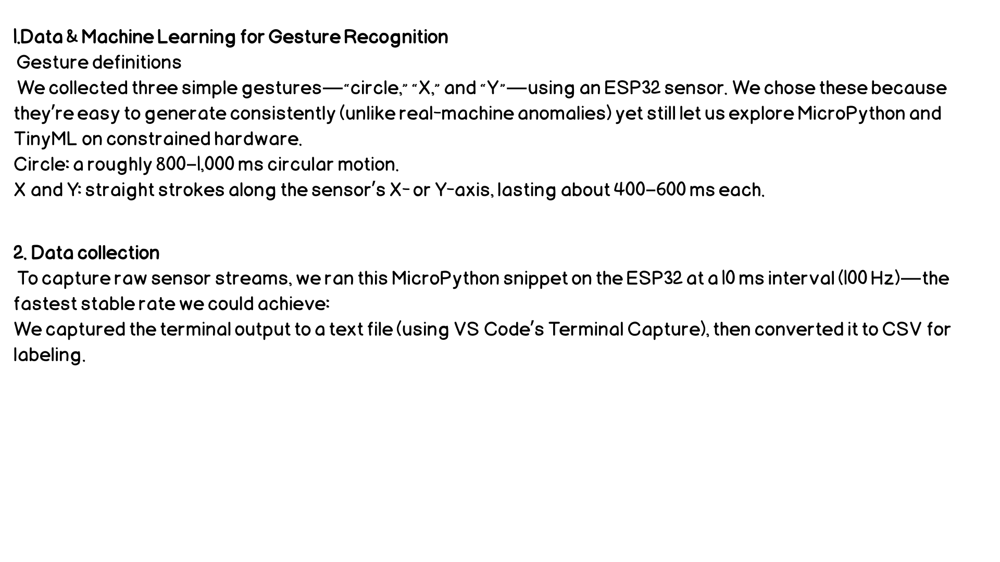
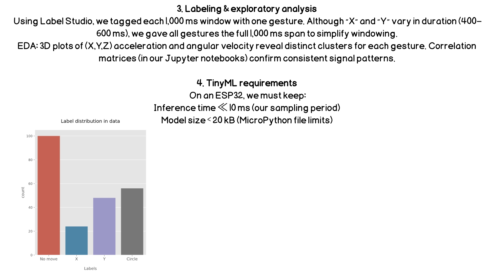
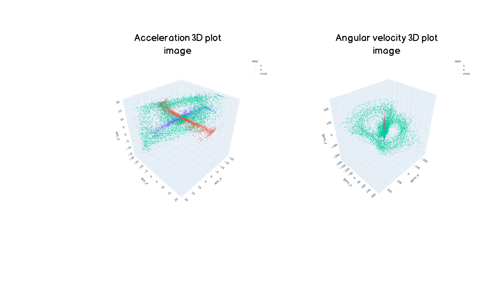
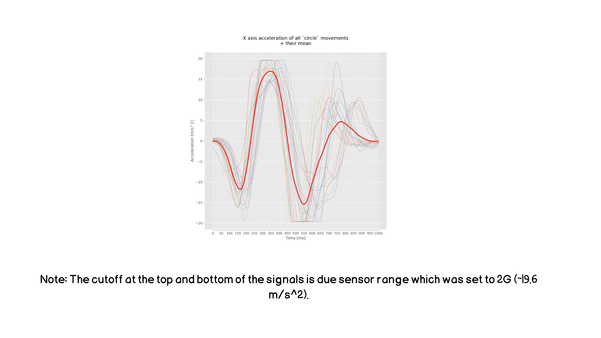
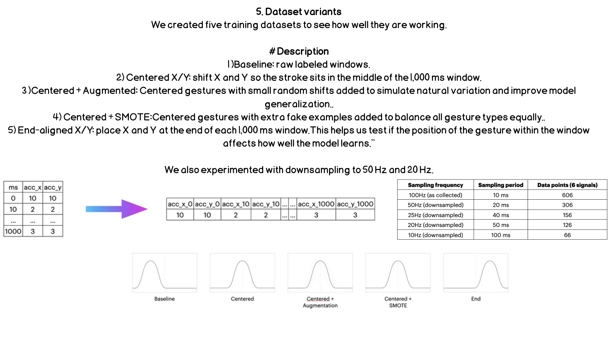
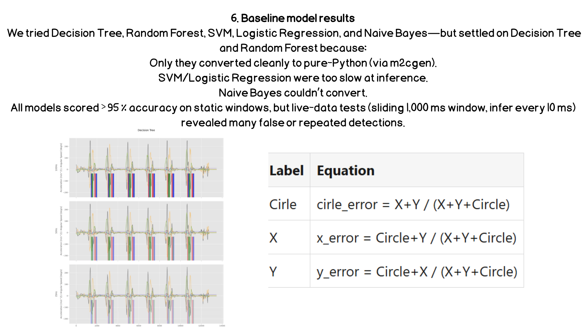
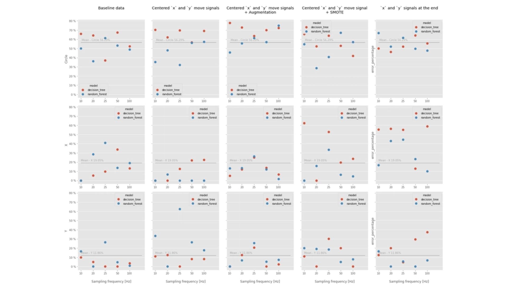
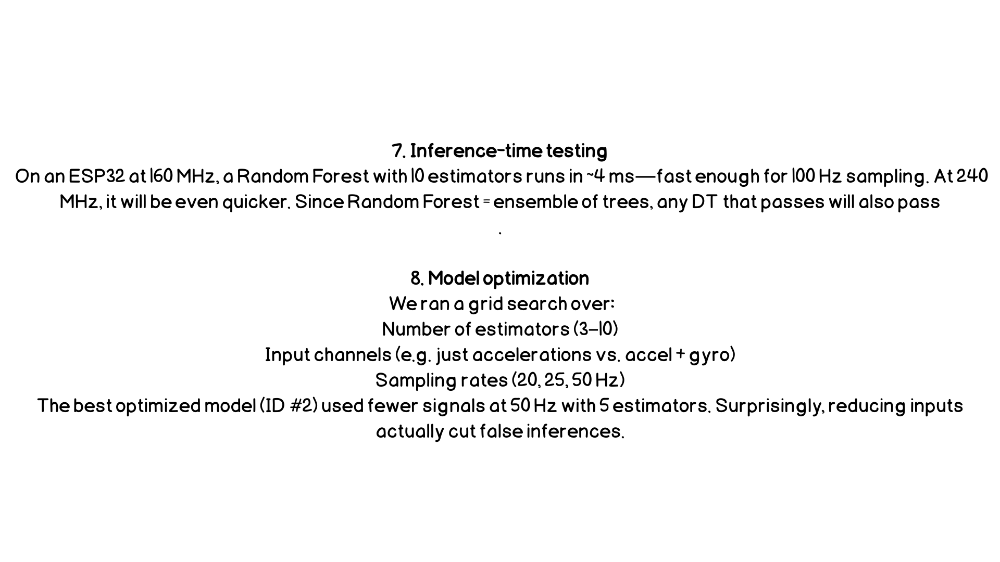
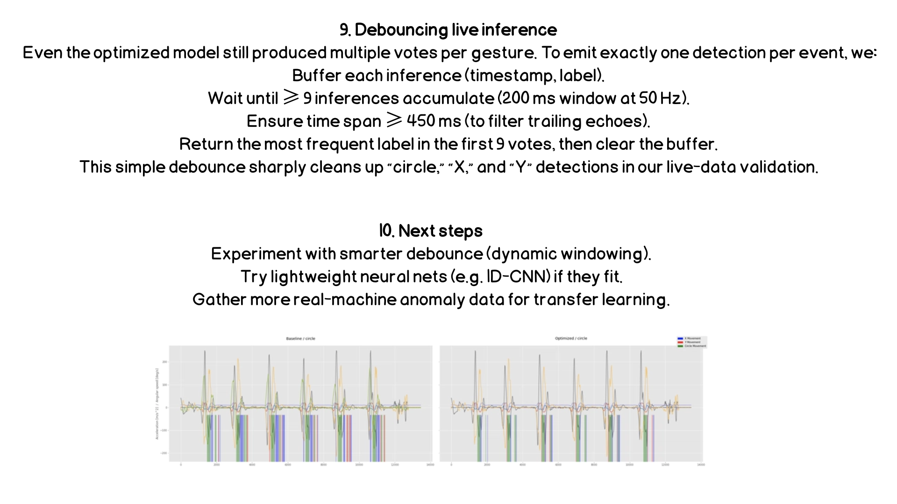
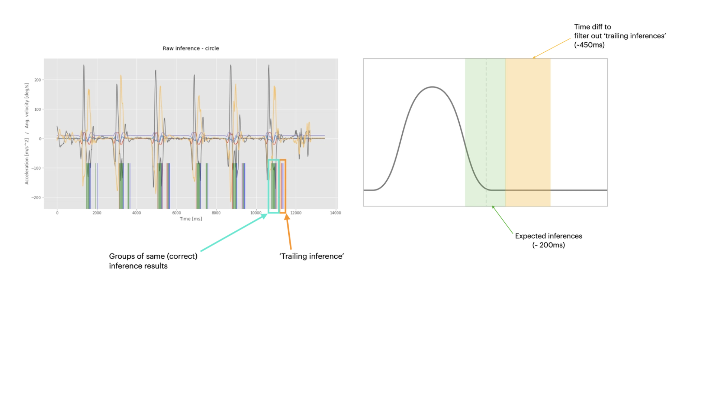
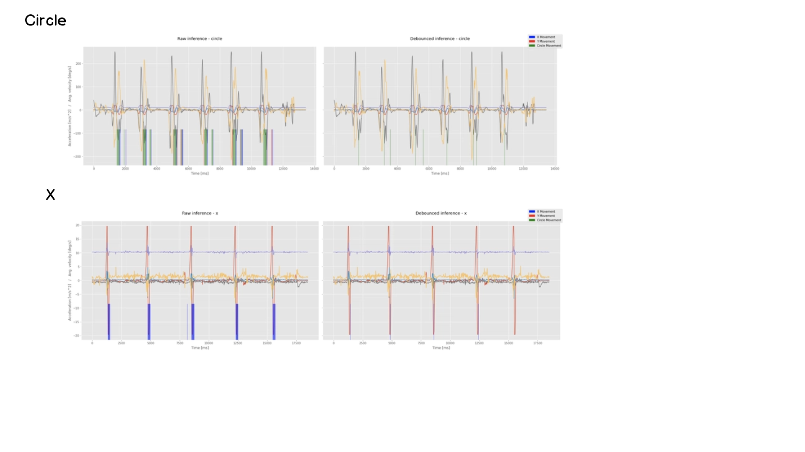

## Installation
```
pip install -r requirements.txt
```
